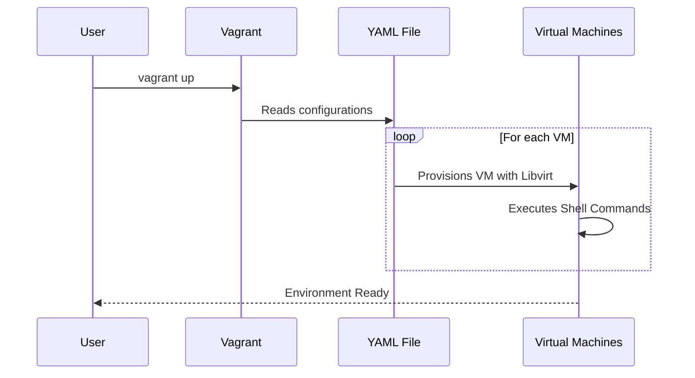

# Vagrant Configuration for Kubernetes Lab

This guide provides an overview of setting up and running a Kubernetes lab environment using Vagrant and QEMU/KVM (libvirt) on WSL (Windows Subsystem for Linux) with Windows 11.

## Overview

The environment consists of a set of virtual machines that are configurable through a YAML file. These VMs can be control planes and worker nodes, allowing the creation of a Kubernetes cluster for testing and development purposes.

### Configuration YAML File

The `configuration.yaml` file allows for detailed customization of the VMs, including memory, CPUs, IP, and disk size. Custom shell commands can also be specified for execution after the VM provisioning.

Basic structure of `configuration.yaml`:

```yaml
vagrant_api_version: "2"
host_os: "generic/ubuntu2204"
default_user: ubuntu

servers:
  control_planes:
    control-plane-0:
      memory: 8000
      cpus: "4"
      ip: "192.168.122.200"
      root_disk_size: 200

  workers_nodes:
    worker-0:
      memory: 4000
      cpus: "4"
      ip: "192.168.122.230"
    worker-1:
      memory: 4000
      cpus: "4"
      ip: "192.168.122.231"

shell_commands: |
  ls -ltra /tmp/ >> /tmp/lista.txt
  date >> /tmp/lista.txt
```

### Vagrantfile

The `Vagrantfile` reads the configuration from the YAML and provisions the VMs as specified. It sets the default provider to `libvirt`, suitable for environments utilizing QEMU/KVM.

Key features:

- VM configuration based on YAML for easy customization.
- Support for custom shell commands for each VM.
- Specific resource configuration such as memory, CPUs, and disk size.

### Execution Process (Mermaid Sequence Diagram)



### Customization and Usage

- **Control Planes and Worker Nodes**: Customize the number and resources of each virtual machine by editing the `configuration.yaml` file.
- **Shell Commands**: Add or modify shell commands to be executed after the VMs are provisioned in the YAML file.
- **Ansible and Other Provisioners**: In future versions, we plan to add support for executing Ansible playbooks directly from the `Vagrantfile`.

## Conclusion

This Vagrant environment is ideal for quickly setting up Kubernetes labs, providing developers and researchers with a flexible and efficient means to test cluster configurations, applications, and Kubernetes tools.
