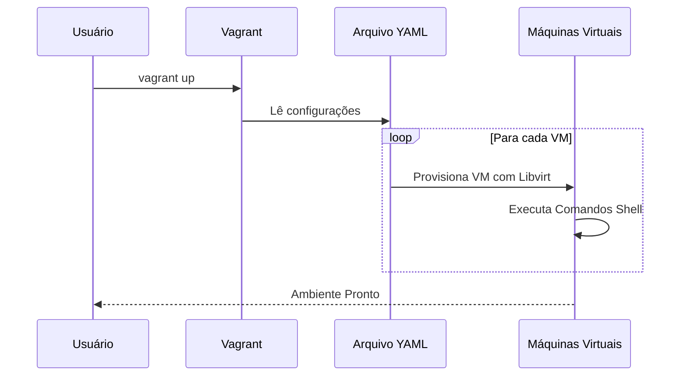

# Vagrant Configuration for Kubernetes Lab

Este guia oferece uma visão geral de como configurar e executar um ambiente de laboratório Kubernetes usando Vagrant e QEMU/KVM (libvirt) no WSL (Windows Subsystem for Linux) com o Windows 11.

## Visão Geral

O ambiente consiste em um conjunto de máquinas virtuais configuráveis através de um arquivo YAML. Essas VMs podem ser control planes e worker nodes, permitindo a criação de um cluster Kubernetes para testes e desenvolvimento.

### Arquivo de Configuração YAML

O arquivo `configuration.yaml` permite a customização detalhada das VMs, incluindo memória, CPUs, IP e tamanho do disco. Comandos shell personalizados também podem ser especificados para execução após o provisionamento da VM.

Estrutura básica do `configuration.yaml`:

```yaml
vagrant_api_version: "2"
host_os: "generic/ubuntu2204"
default_user: ubuntu

servers:
  control_planes:
    control-plane-0:
      memory: 8000
      cpus: "4"
      ip: "192.168.122.200"
      root_disk_size: 200

  workers_nodes:
    worker-0:
      memory: 4000
      cpus: "4"
      ip: "192.168.122.230"
    worker-1:
      memory: 4000
      cpus: "4"
      ip: "192.168.122.231"

shell_commands: |
  ls -ltra /tmp/ >> /tmp/lista.txt
  date >> /tmp/lista.txt
```

### Vagrantfile

O `Vagrantfile` lê a configuração do YAML e provisiona as VMs conforme especificado. Ele define o provedor padrão como `libvirt`, adequado para ambientes que utilizam QEMU/KVM.

Funcionalidades principais:

- Configuração de VMs baseada em YAML para fácil customização.
- Suporte a comandos shell personalizados para cada VM.
- Configuração específica de recursos como memória, CPUs e tamanho do disco.

### Processo de Execução (Diagrama de Sequência Mermaid)



### Customização e Uso

- **Control Planes e Worker Nodes**: Customize a quantidade e os recursos de cada máquina virtual editando o arquivo `configuration.yaml`.
- **Comandos Shell**: Adicione ou modifique comandos shell para serem executados após o provisionamento das VMs no arquivo YAML.
- **Ansible e Outros Provisionadores**: Em versões futuras, planejamos adicionar suporte para execução de playbooks do Ansible diretamente do `Vagrantfile`.

## Conclusão

Este ambiente Vagrant é ideal para a configuração rápida de laboratórios Kubernetes, permitindo aos desenvolvedores e pesquisadores um meio flexível e eficiente de testar configurações de cluster, aplicações e ferramentas Kubernetes.
